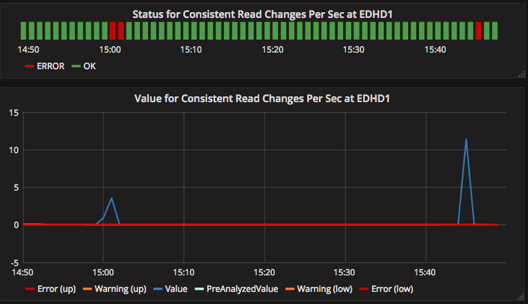
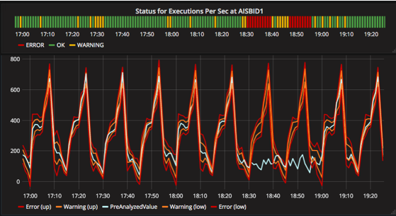
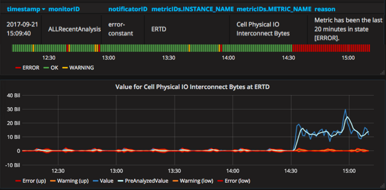

# Spark Streaming job for monitoring metrics: user manual

## Running the job

```
$SPARK_HOME/bin/spark-submit \
	--master yarn \
	--class ch.cern.spark.metrics.Driver \
	spark-metrics-*.jar \
	<path_to_conf_file>
```

## Configuration

A basic configuration contains a metric source, one or more monitors and analysis result or notifications sink.

Each monitor and notificator must have a different ID.

```
checkpoint.dir = <path_to_store_stateful_data> (default: /tmp/)
spark.batch.time = <seconds> (default: 30)

# Optional
properties.source.type = <properties_source_type>
properties.source.<other_confs> = <value>

# Mandatory
metrics.source.type = <metric_source_type>
metrics.source.<other_confs> = <value>

# Optional
metrics.define.<defined-metric-1>...
metrics.define.<defined-metric-2>...
metrics.define.<defined-metric-n>...

# At least one sink must be declared
results.sink.type = <analysis_results_sink_type>
results.sink.<other_confs> = <value>
notifications.sink.type = <notifications_sink_type>
notifications.sink.<other_confs> = <value>

# Monitors
monitor.<monitor-id-1>.<confs>...
monitor.<monitor-id-2>.<confs>...
monitor.<monitor-id-n>.<confs>...
```

An example of full configuration can be:

```
checkpoint.dir = /tmp/spark-metrics-job/

# Metric comes from a Kafka cluster
metrics.source.type = kafka
metrics.source.consumer.bootstrap.servers = habench101.cern.ch:9092,habench102.cern.ch:9092,habench103.cern.ch:9092
metrics.source.consumer.group.id = spark_metric_analyzer
metrics.source.topics = db-logging-platform
# These two parameters are extracted from metrics (they are enough to identify a metric)
metrics.source.parser.attributes = INSTANCE_NAME METRIC_NAME
metrics.source.parser.value.attribute = VALUE
metrics.source.parser.timestamp.attribute = END_TIME

metrics.define.DBCPUUsagePercentage.value = DBCPUUsagePerSec / HostCPUUsagePerSec
metrics.define.DBCPUUsagePercentage.metric.groupby = INSTANCE_NAME
metrics.define.DBCPUUsagePercentage.metric.DBCPUUsagePerSec.filter.attribute.METRIC_NAME = CPU Usage Per Sec
metrics.define.DBCPUUsagePercentage.metric.HostCPUUsagePerSec.filter.attribute.METRIC_NAME = Host CPU Usage Per 

# Analysis results are sinked to Elastic
results.sink.type = elastic
results.sink.index = itdb_db-metric-results/log

# Notifications are sinked to Elastic
notifications.sink.type = elastic
notifications.sink.index = itdb_db-metric-notifications/log

spark.es.nodes=es-itdb.cern.ch
spark.es.port=9203

# Monitor CPU of all instances
# attribute.INSTANCE_NAME does not need to be specified, same efect as regex:.*
monitor.CPUUsage.filter.attribute.INSTANCE_NAME = regex:.*
monitor.CPUUsage.filter.attribute.METRIC_NAME = CPU Usage Per Sec
monitor.CPUUsage.pre-analysis.type = weighted-average
monitor.CPUUsage.pre-analysis.period = 10m
monitor.CPUUsage.analysis.type = fixed-threshold
monitor.CPUUsage.analysis.error.upperbound = 800
monitor.CPUUsage.analysis.warn.upperbound  = 600
monitor.CPUUsage.analysis.error.lowerbound = -1
# This monitor does not produce notifications

# Monitor percentage of DB usage of all instances
monitor.DBCPU.filter.attribute.$defined_metric = DBCPUUsagePercentage
monitor.DBCPU.pre-analysis.type = weighted-average
monitor.DBCPU.pre-analysis.period = 10m
monitor.DBCPU.analysis.type = fixed-threshold
monitor.DBCPU.analysis.error.upperbound = 800DBCPU
monitor.DBCPU.analysis.warn.upperbound  = 600
monitor.DBCPU.analysis.error.lowerbound = -1
# This monitor does not produce notifications

# Monitor all metrics (no filter)
monitor.all-seasonal.missing.max-period = 3m
monitor.all-seasonal.pre-analysis.type = weighted-average
monitor.all-seasonal.pre-analysis.period = 3m
monitor.all-seasonal.analysis.type = seasonal
monitor.all-seasonal.analysis.season = hour
monitor.all-seasonal.analysis.learning.ratio = 0.2
monitor.all-seasonal.analysis.error.ratio = 6
monitor.all-seasonal.analysis.warn.ratio = 3
monitor.all-seasonal.notificator.error-constant.type = constant
monitor.all-seasonal.notificator.error-constant.statuses = ERROR
monitor.all-seasonal.notificator.error-constant.period = 10m
monitor.all-seasonal.notificator.warn-constant.type = constant
monitor.all-seasonal.notificator.warn-constant.statuses = WARNING
monitor.all-seasonal.notificator.warn-constant.period = 20m
```

## Define new metrics

```
metrics.define.<deined-metric-id>.value = <methematical equation containing <metric-ids>>
metrics.define.<deined-metric-id>.when = <comma separated list of metric-ids> (default: the first one after sorting)
metrics.define.<deined-metric-id>.metric.groupby = <notSet/ALL/comma separated attribute names> (default: not set)
metrics.define.<deined-metric-id>.metric.<metrid-id-1>.filter.attribute.<attribute-name-1> = <value-1>
metrics.define.<deined-metric-id>.metric.<metrid-id-1>.filter.attribute.<attribute-name-2> = <value-2>
metrics.define.<deined-metric-id>.metric.<metrid-id-1>.filter.attribute....
metrics.define.<deined-metric-id>.metric.<metrid-id-2>.filter.attribute....
metrics.define.<deined-metric-id>.metric....

# With different ids, more metrics can be declared
```

New metrics can be defined. The value of these defined metrics is computed from a mathematical equation  configured with the "value" parameter. This equation can have or not variables, these variables represent incoming metrics. So, values from several metrics can be aggregated in order to compute the value for the new metric.

Equation (value parameter) can do addition (+), subtraction (-), multiplication (*), division(/), exponentiation (^), and a few functions like sqrt(x), sin(x), cos(x) and tan(x). It supports grouping using (), and it applies the operator precedence and associativity rules.

The computation and further generation of a new metric will be produced when the metric/s listed in the "when" parameter arrive. By default, a new metric is produced when the first (after sorting alphabetically by <metric-id>) declared metric arrive. Last value of the other metrics will be used for the computation.

Metrics can be grouped by (e.g. machine) with the "groupby" parameter in order to apply the equation to a set of metrics. Group by can be set to ALL, then each metric will be treated independently.

You need to specify what the variables in your equation represent by declaring metrics (&lt;metrid-id-X&gt;). Then, ID can be used in the equation. Even tough you do not use any variable in the equation, at least one metric must be declared to trigger the computation.

A meta-attribute is set in the generated metrics. The attribute name is $defined_metric and his value the &lt;deined-metric-id&gt;. This attribute can later be used to filter the defined metrics in a monitor like:
```
monitor.<monitor_id>.filter.attribute.$defined_metric = <deined-metric-id>
```

Configuration of defined metrics can be updated while running.

Some examples of declared metrics can be:

- Multiply all metrics by 10
```
metrics.define.all-multiply-by-10.value = value * 10
metrics.define.all-multiply-by-10.metric.groupby = ALL
# One of the following two would be enough
metrics.define.all-multiply-by-10.metric.value.filter.attribute.INSTANCE_NAME = regex:.*
metrics.define.all-multiply-by-10.metric.value.filter.attribute.METRIC_NAME = regex:.*
```

- Divide CPU usage coming from all machines by 1000
```
metrics.define.cpu-percentage = value / 1000
metrics.define.cpu-percentage.metric.groupby = ALL
# Same effect if we specify INSTANCE_NAME=regex:.* or not
#metrics.define.cpu-percentage.metric.value.filter.attribute.INSTANCE_NAME = regex:.*
metrics.define.cpu-percentage.metric.value.filter.attribute.METRIC_NAME = CPU Usage Per Sec
```

- Compute the ratio read/write for all machines:
```
metrics.define.ratio_read_write.value = readbytes / writebytes
metrics.define.ratio_read_write.metric.groupby = HOSTNAME
metrics.define.ratio_read_write.metric.readbytes.filter.attribute.METRIC_NAME = Read Bytes Per Sec
metrics.define.ratio_read_write.metric.writebytes.filter.attribute.METRIC_NAME = Write Bytes Per Sec
```

- Temperature inside minus temperature outside in Fahrenheits: 
```
metrics.define.diff_temp.value = (tempinside - tempoutside) * 9/5 + 32
# We do not group by, so that we can aggregate any metrics
metrics.define.diff_temp.metric.tempinside.filter.attribute.PLACE = Living Room
metrics.define.diff_temp.metric.tempinside.filter.attribute.METRIC = Temperature
metrics.define.diff_temp.metric.tempoutside.filter.attribute.PLACE = Outside
metrics.define.diff_temp.metric.tempoutside.filter.attribute.METRIC = Temperature
``` 

### Monitors

```
## filter (optional)
monitor.<monitor-id>.filter.attribute.<metric_attribute_key> = regex:<regex_for_value>|<exact_value>
monitor.<monitor-id>.filter.attribute... (as many attributes as needed)
## missing metric (optional)
monitor.<monitor-id>.missing.max-period = <period like 1h, 3m or 45s>
## pre-analysis (optional)
monitor.<monitor-id>.pre-analysis.type = <preanalysis_type>
monitor.<monitor-id>.pre-analysis.<other_confs> = <value>
## analysis 
monitor.<monitor-id>.analysis.type = <analysis_type>
monitor.<monitor-id>.analysis.<other_confs> = <value>
## notificators (optional)
monitor.<monitor-id>.notificator.<notificator-id>.type = <notificator-type>
monitor.<monitor-id>.notificator.<notificator-id>.<other_confs> = <value>
monitor.<monitor-id>.notificator.<notificator-id>... (as many notificators as needed)
```

Configuration of monitors can be updated while running.

#### Filter

The filter determine the rules a metric must pass in order to accept the metric for the monitor.

It acts on the attributes of the metrics. Only configured attributes are checked.

It can specify an exact value for the attribute:
```
monitor.<monitor_id>.filter.attribute.<attribute_key> = <value>
```
or a regex expression:
```
monitor.<monitor_id>.filter.attribute.<attribute_key> = regex:<regex_expression>
```

#### Missing metric maximum period

For each monitor, a maximun period missing a metric can be configured. If a metric is missing during such period, an EXCEPTION status will result.

To configure that:
```
monitor.<monitor-id>.missing.max-period = <period like 1h, 3m or 45s>
```

## Componenets

For any of the components, type must be specified. Type can be any of the built-in components or a FQCN of an external component.

### Properties source

As mentioned, configuration is dynamic and can be changed while running. 
Configuration parameters come from the configuration file but these parameters can be merged with parameters coming from an external source. 
Note that parameters from configuration file will not be overwritten by parameters coming from the external source. 

This source will be continuously queried and the job will be updated with coming properties.

To configure an external source of properties:

```
properties.source.type = <properties_source_type>
properties.source.<other_confs> = <value>
```

### Metric sources

#### Kafka metric source

It expects documents as JSON.

Configuration:
```
metrics.source.type = kafka
metrics.source.topics = <consumer topic>
metrics.source.consumer.bootstrap.servers = <bootstrap_servers separated by comma>
metrics.source.consumer.group.id = <consumer_group_id>
# All these parameters (source.consumer.) will by passed to the consumer
metrics.source.consumer.<any_other_key> = <any_other_value>
metrics.source.parser.attributes = <attributs to extract from the JSON>
metrics.source.parser.value.attribute = <attribute that represent the value>
metrics.source.parser.timestamp.attribute = <attribute that represent the time>
metrics.source.parser.timestamp.format = <timestamp_format> (default: yyyy-MM-dd'T'HH:mm:ssZ)
```

### Metric pre-analysis

#### Average value

Produced value is computed as the average from all the values from the previous configured period.

Configuration:
```
monitor.<monitor-id>.pre-analysis.type = average
monitor.<monitor-id>.pre-analysis.period = <period like 1h, 3m or 45s> (default: 5m)
```

An example of the result of this pre-analysis can be seen in the following image.


#### Weighted average

Produced value is computed as the weighted average from all the values from the previous configured period.
Value weight is inversely proportional to the difference in time between the metric and current time.
The coler in time the metric is to current time, the more influence is has over produced value.
 
Configuration:
```
monitor.<monitor-id>.pre-analysis.type = weighted-average
monitor.<monitor-id>.pre-analysis.period = <period like 1h, 3m or 45s> (default: 5m)
```

An example of the result of this pre-analysis can be seen in the following image.


#### Difference with previos value

Analyszed value will be the difference of metric value with previous value.

Configuration:
```
monitor.<monitor-id>.pre-analysis.type = difference
```

An example of the result of this pre-analysis can be seen in the following image.


### Metric analysis

#### Fixed thresholds analysis

Fixed values determine the status of the metric. 
If metric goes upper or lower these values, corresponding status (warning or error) is produced. Otherwise, ok status is produced.

Configuration:
```
monitor.<monitor-id>.analysis.type = fixed-threshold
monitor.<monitor-id>.analysis.error.upperbound = <value>
monitor.<monitor-id>.analysis.warn.upperbound  = <value>
monitor.<monitor-id>.analysis.warn.lowerbound  = <value>
monitor.<monitor-id>.analysis.error.lowerbound = <value>
```

An example of the result of this analysis can be seen in the following image.


#### Recent activity analysis 

Error and warning thresholds are computed using average and variance from previos period.

- Upper error threshold is computed as: mean + variance * error.ratio
- Upper warning threshold is computed as: mean + variance * warn.ratio
- Lower warning threshold is computed as: mean - variance * warn.ratio
- Lower error threshold is computed as: mean - variance * error.ratio

Configuration:
```
monitor.<monitor-id>.analysis.type = recent
monitor.<monitor-id>.analysis.period = <period like 1h, 3m or 45s> (default: 5m)
monitor.<monitor-id>.analysis.error.ratio = <float> (dafault: 1.8)
monitor.<monitor-id>.analysis.warn.ratio = <float> (dafault: 1.5)
# Each threshold can be activated by:
monitor.<monitor-id>.analysis.error.upperbound = <true|false> (default: false)
monitor.<monitor-id>.analysis.warn.upperbound  = <true|false> (default: false)
monitor.<monitor-id>.analysis.warn.lowerbound  = <true|false> (default: false)
monitor.<monitor-id>.analysis.error.lowerbound = <true|false> (default: false)
```

An example of the result of this analysis can be seen in the following image.


#### Percentile analysis

Error and warning thresholds are computed using percentiles from previos period.

- Upper error threshold is computed as: percentile(error.percentile) + diff(percentile - median) * error.ratio
- Upper warning threshold is computed as: percentile(warn.percentile) + diff(percentile - median) * warn.ratio
- Lower warning threshold is computed as: percentile(100 - warn.percentile) - diff(percentile - median) * warn.ratio
- Lower error threshold is computed as: percentile(100 - error.percentile) - diff(percentile - median) * error.ratio

Configuration:
```
monitor.<monitor-id>.analysis.type = percentile
monitor.<monitor-id>.analysis.period = <period like 1h, 3m or 45s> (default: 5m)
monitor.<monitor-id>.analysis.error.percentile = <50-100> (dafault: 99)
monitor.<monitor-id>.analysis.error.ratio = <float> (dafault: 0.3)
monitor.<monitor-id>.analysis.warn.percentile = <50-100> (dafault: 98)
monitor.<monitor-id>.analysis.warn.ratio = <float> (dafault: 0.2)
# Each threshold can be activated by:
monitor.<monitor-id>.analysis.error.upperbound = <true|false> (default: false)
monitor.<monitor-id>.analysis.warn.upperbound  = <true|false> (default: false)
monitor.<monitor-id>.analysis.warn.lowerbound  = <true|false> (default: false)
monitor.<monitor-id>.analysis.error.lowerbound = <true|false> (default: false)
```

An example of the result of this analysis can be seen in the following image.


#### Seasonal analysis

Metric is supposed to behave similarly in every season. Saeson can be hour, day or week.

Using a learning coeficient, average and variance are computed along the season for every minute, these two values are used to calculate error and warning thresholds.

- Upper error threshold is computed as: mean + standDev * error.ratio
- Upper warning threshold is computed as: mean + standDev * warn.ratio
- Lower warning threshold is computed as: mean - standDev * warn.ratio
- Lower error threshold is computed as: mean - standDev * error.ratio

Configuration:
```
monitor.<monitor-id>.analysis.type = seasonal
monitor.<monitor-id>.analysis.season = <hour, day or week>
monitor.<monitor-id>.analysis.learning.ratio = <float> (default: 0.5)
monitor.<monitor-id>.analysis.error.ratio = <float> (default: 4)
monitor.<monitor-id>.analysis.warn.ratio = <float> (default: 2)
```  

An example of the result of this analysis can be seen in the following image.


### Analysis results sinks

#### Elastic sink

Analysis results are converted to JSON an sinked to an Elastic index.

```
results.sink.type = elastic
results.sink.index = <index>
spark.es.nodes=<nodes>
spark.es.port=<port>
spark.es.<any_other_attribute> = <value>
```

### Notificators

#### Constant status notificator

If a metric has been in configured statuses during the configured period, it produces a notification.

If a notification is raised, next notification will be produced as shorter as the period time.

Possible statuses are: error, warning, ok, exception.

Configuration:
```
monitor.<monitor-id>.notificator.<notificator-id>.type = constant
monitor.<monitor-id>.notificator.<notificator-id>.statuses = <concerned statuses separated by comma>
monitor.<monitor-id>.notificator.<notificator-id>.period = <period like 1h, 3m or 45s> (default: 15m)
```

An example of the result of this notificator can be seen in the following image.


#### Percentage status notificator

If a metric has been in configured statuses during a percentage of the configured period, it produces a notification.

If a notification is raised, next notification will be produced as shorter as the period time.

Possible statuses are: error, warning, ok, exception.

Configuration:
```
monitor.<monitor-id>.notificator.<notificator-id>.type = percentage
monitor.<monitor-id>.notificator.<notificator-id>.statuses = <concerned statuses separated by comma>
monitor.<monitor-id>.notificator.<notificator-id>.period = <period like 1h, 3m or 45s> (default: 15m)
monitor.<monitor-id>.notificator.<notificator-id>.percentage = <0-100> (default: 90)
```

An example of the result of this notificator can be seen in the following image.


### Notifications sinks

Notifications are converted to JSON an sinked to an Elastic index.

```
notifications.sink.type = elastic
notifications.sink.index = <index>
spark.es.nodes=<nodes>
spark.es.port=<port>
spark.es.<any_other_attribute> = <value>
```